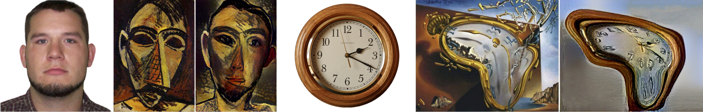

# learning-warp-st

This is the code for the paper

**Learning to Warp for Style Transfer**

<p align='center'>
  
  Our method performs non-parametric warping to match artistic geometric style. The above shows content, style (geometry+texture), and output images for a Picasso style transfer (left) and a Salvaor Dali style transfer (right).
</ p>

If you find this code useful for your research, please cite
```
@InProceedings{Liu21LWST, 
  author={Xiao-Chang Liu and Yong-Liang Yang and Peter Hall},
  title={Learning to Warp for Style Transfer},
  booktitle={IEEE Conference on Computer Vision and Pattern Recognition (CVPR)},
  year={2021}
}
```
